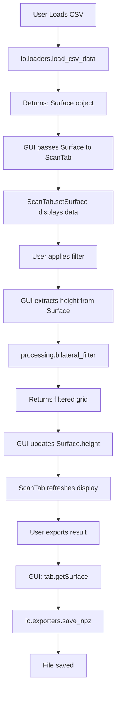
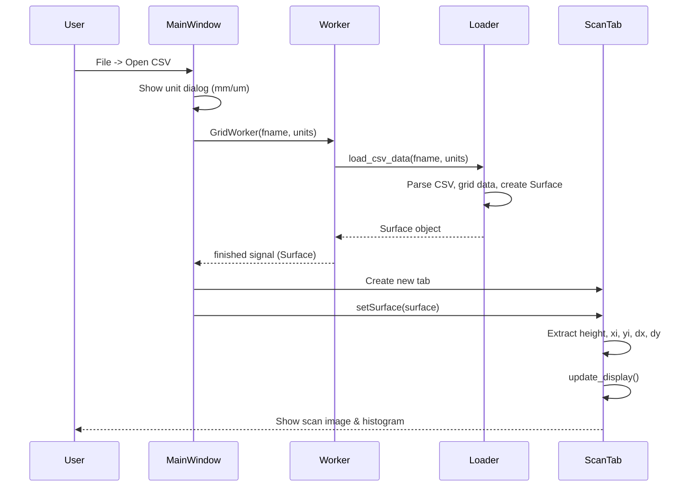
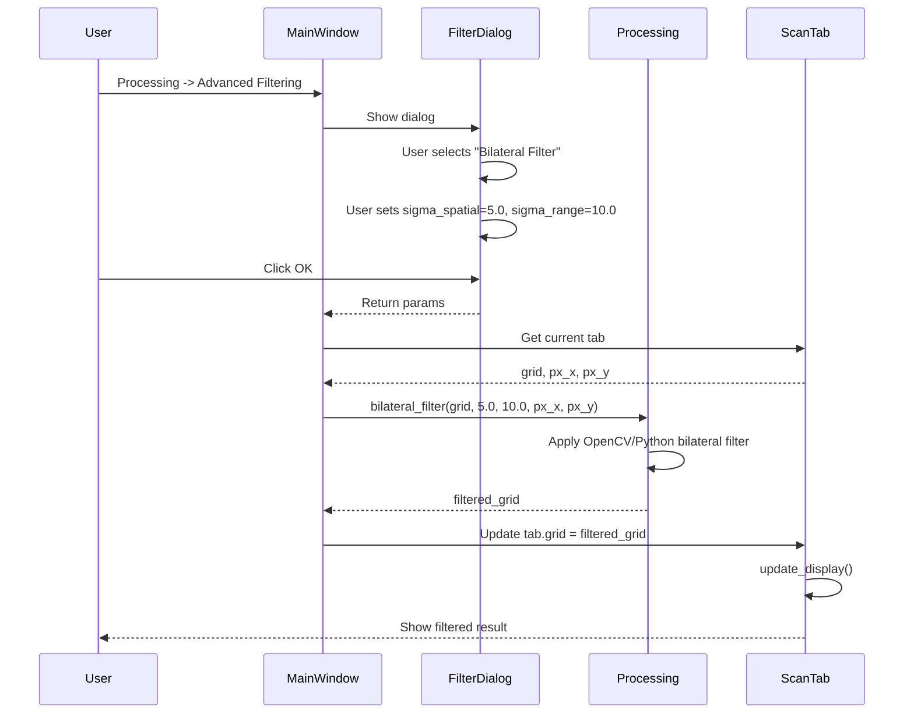
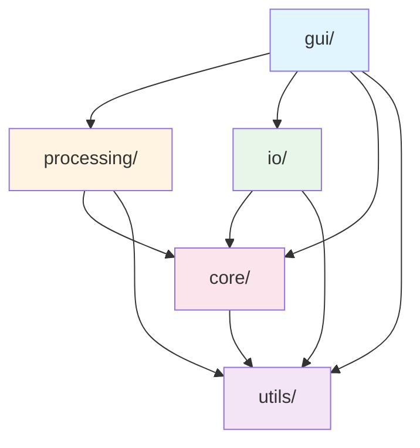

# FRASTA-toolbox Architecture Guide

This document describes the architecture, design patterns, and conventions used in FRASTA-toolbox. Read this before making changes to understand how components interact and where new features should be added.

---

## Table of Contents

1. [Overview](#overview)
2. [Core Principles](#core-principles)
3. [Module Structure](#module-structure)
4. [Data Flow](#data-flow)
5. [Key Design Patterns](#key-design-patterns)
6. [Adding New Features](#adding-new-features)
7. [Testing Strategy](#testing-strategy)
8. [Common Pitfalls](#common-pitfalls)

---

## Overview

FRASTA-toolbox is a modular desktop application for fracture surface analysis built on:
- **PyQt5** - GUI framework
- **pyqtgraph** - fast 2D/3D visualization
- **NumPy/SciPy** - numerical computations
- **scikit-learn** - robust regression algorithms
- **OpenCV** (optional) - accelerated image processing

### Architecture Philosophy

**Separation of Concerns**: Each module has a single, clear responsibility.
- `core/` = data structures
- `io/` = loading/saving data
- `processing/` = algorithms (pure functions)
- `gui/` = user interface orchestration

**No Circular Dependencies**: Dependencies flow one way:
```
gui -> processing -> core
  v       v
  io  ->  core
```

**Pure Functions**: Processing functions don't modify input data in-place, always return new arrays/objects.

---

## Core Principles

### 1. **Immutability in Processing**

All functions in `processing/` are **pure functions** - they:
- OK Take input arrays and parameters
- OK Return new arrays/tuples without side effects
- BAD Never modify input arrays in-place
- BAD Never call GUI functions or access global state

**Example:**
```python
# CORRECT OK
def bilateral_filter(grid, sigma_spatial, sigma_range, px_x=1.0, px_y=1.0, mask=None):
    grid = grid.copy()  # Work on copy
    # ... processing ...
    return result

# WRONG BAD
def bilateral_filter(grid, sigma_spatial, sigma_range):
    grid[mask] = filtered_values  # Modifying input!
    return grid
```

### 2. **Surface is a Container, Not a Business Object**

`Surface` is a simple data holder with no business logic:
```python
class Surface:
    def __init__(self, height, dx, dy, x0=0.0, y0=0.0, mask=None, unit="um", metadata=None, vmin=None, vmax=None):
        self.height = height  # 2D numpy array
        self.dx = dx          # Pixel size in x (um)
        self.dy = dy          # Pixel size in y (um)
        self.x0 = x0          # Origin/offset for X coordinates
        self.y0 = y0          # Origin/offset for Y coordinates
        self.mask = mask      # Boolean mask
        self.unit = unit      # Physical unit
        self.metadata = {}    # Additional metadata
        self.vmin = vmin      # Display range min
        self.vmax = vmax      # Display range max
    
    @property
    def xi(self):  # Generated from x0, dx and shape
        return self.x0 + np.arange(self.nx) * self.dx
    
    @property
    def yi(self):  # Generated from y0, dy and shape
        return self.y0 + np.arange(self.ny) * self.dy
```

**Use it for:**
- OK Passing scan data between GUI components
- OK Storing visualization metadata (vmin/vmax)
- OK Simple utility methods (crop, copy)

**Don't use it for:**
- BAD Processing algorithms (use numpy arrays instead)
- BAD Business logic (filtering, leveling, etc.)
- BAD Complex state management

### 3. **Lazy Imports in GUI**

GUI modules import processing functions **only when needed**:
```python
# In main_window.py
def apply_bilateral_filter(self):
    from ..processing import bilateral_filter  # Import on demand
    
    current_tab = self.get_current_tab()
    result = bilateral_filter(current_tab.grid, sigma_spatial=5.0, ...)
```

**Why?** Reduces startup time and allows processing to be used independently.

### 4. **Units Convention**

All spatial measurements use **micrometers (um)** as the standard unit:
- `px_x, px_y` - pixel sizes in um
- `xi, yi` - coordinate arrays in um
- `grid` - height values in um

Conversions happen **only at I/O boundaries**:
- `load_stl_data()` converts from mm -> um
- `save_stl()` converts from um -> mm
- All internal processing stays in um

---

## Module Structure

```
frasta/
+-- core/           # Data structures
|   +-- grid_data.py
+-- io/             # File I/O (loaders & exporters)
|   +-- loaders.py
|   +-- exporters.py
+-- processing/     # Analysis algorithms (pure functions)
|   +-- filtering.py
|   +-- advanced_filtering.py
|   +-- morphology.py
|   +-- alignment.py
|   +-- transforms.py
|   +-- interpolation.py
|   +-- plane_fitting.py
+-- gui/            # User interface
|   +-- main_window/
|   |   +-- main_window.py
|   |   +-- roi_controller.py
|   |   +-- file_controller.py
|   |   +-- processing_controller.py
|   |   +-- registration_controller.py
|   |   +-- menu_builder.py
|   |   +-- toolbar_builder.py
|   +-- scan_tab/
|   |   +-- scan_tab.py
|   |   +-- histogram_manager.py
|   |   +-- interactive_handler.py
|   |   +-- transform_operations.py
|   +-- dialogs/
|   |   +-- processing_dialog.py
|   |   +-- profile_viewer/
|   |   +-- overlay_viewer.py
|   |   +-- about.py
|   +-- viewers/
|   |   +-- grid_3d_viewer/
|   |   |   +-- grid_3d_viewer.py
|   |   |   +-- lod_manager.py
|   |   |   +-- colormap_manager.py
|   |   |   +-- surface_renderer.py
|   |   |   +-- profile_manager.py
|   |   |   +-- camera_controller.py
|   |   +-- lod_surface.py
|   |   +-- limited_gl_view.py
|   +-- widgets/
|   |   +-- surface_control_panel.py
|   |   +-- responsive_infinite_line.py
|   +-- workers/
|       +-- csv_loader_worker.py
|       +-- profile_loader_worker.py
+-- utils/          # Shared utilities
    +-- decorators.py
    +-- resources.py
```

### Detailed Module Responsibilities

#### `core/` - Data Structures
**Single responsibility:** Define data containers.

- `Surface` - holds scan data with metadata
- No algorithms, no I/O, no GUI dependencies
- Only simple utility methods (crop, copy)

**When to modify:** Only when changing fundamental data representation.

---

#### `io/` - File I/O
**Single responsibility:** Load and save scan data.

**Key Files:**
- `loaders.py` - functions for reading CSV, NPZ, HDF5, STL formats
- `exporters.py` - functions for writing NPZ, HDF5, STL formats

**Contract:**
- **Loaders return:** `Surface` object or list of `Surface` objects
- **Exporters take:** list of tuples `[(name, Surface), ...]`
- Handle unit conversions at file boundary (mm <-> um)
- **Never** perform data processing (filtering, leveling, etc.)
- Preserve spatial positioning (`x0`, `y0`) when loading data

**When to add new function:**
- New file format support
- New unit conversion

**When NOT to add:**
- Data validation -> use `processing/`
- Coordinate transformations -> use `processing/transforms.py`

---

#### `processing/` - Analysis Algorithms
**Single responsibility:** Implement analysis algorithms as pure functions.

**Submodules:**

| File | Purpose | Example Functions |
|------|---------|-------------------|
| `filtering.py` | Basic smoothing/outlier removal | `nan_aware_gaussian()`, `remove_outliers()` |
| `advanced_filtering.py` | Advanced filters | `bilateral_filter()`, `median_filter()`, `morphological_*()` |
| `morphology.py` | Form removal & leveling | `level_by_plane()`, `remove_polynomial_form()`, `threshold_surface()` |
| `alignment.py` | Scan-to-scan alignment | `remove_relative_offset()`, `remove_relative_tilt()` |
| `transforms.py` | Geometric transforms | `rotate_grid()`, `rescale_grid()`, `crop_to_valid_region()`, `auto_register_surfaces()` |
| `interpolation.py` | Hole filling | `fill_holes()` |
| `plane_fitting.py` | Local plane fitting for tilt correction | `fit_plane_local_least_squares()`, `fit_plane_local_ransac()`, `fit_plane_local_median_filter()` |

**Function Signature Pattern:**
```python
def process_function(grid, param1, param2, px_x=1.0, px_y=1.0, mask=None):
    """
    Args:
        grid (np.ndarray): 2D input array
        param1, param2: Algorithm parameters
        px_x, px_y (float): Pixel sizes for physical dimensions
        mask (np.ndarray, optional): Boolean mask for region of interest
        
    Returns:
        np.ndarray: Processed result (new array, input unchanged)
    """
    grid = grid.copy()  # Work on a copy
    # ... processing logic ...
    return result
```

**Rules:**
1. Accept `np.ndarray` as input (NOT `Surface`)
2. Return `np.ndarray` or tuple of arrays/parameters
3. Always document units for spatial parameters
4. Handle NaN values gracefully
5. Respect `mask` parameter if provided
6. Never modify input arrays in-place
7. No GUI imports, no file I/O

**When to add new function:** Any new analysis algorithm.

---

#### `gui/` - User Interface
**Single responsibility:** Orchestrate user interactions, visualize data, call processing functions.

**Key Components:**

```
gui/
+-- main_window/            # Main application window (refactored into controllers)
|   +-- main_window.py          # Main window class with routing
|   +-- roi_controller.py       # ROI operations
|   +-- file_controller.py      # File I/O operations
|   +-- processing_controller.py # Data processing
|   +-- registration_controller.py # Scan comparison/registration
|   +-- menu_builder.py         # Menu and action creation
|   +-- toolbar_builder.py      # Toolbar setup
+-- scan_tab/               # Individual scan display (refactored into components)
|   +-- scan_tab.py             # Main scan widget
|   +-- histogram_manager.py    # Histogram display and threshold controls
|   +-- interactive_handler.py  # Mouse event handling (zero point, tilt, seeds)
|   +-- transform_operations.py # Geometric transformations
+-- dialogs/                # Modal dialogs for parameters & results
|   +-- processing_dialog.py   # Parameter input for filtering/morphology/transforms
|   +-- profile_viewer/         # Cross-section profile analysis (refactored)
|   |   +-- profile_viewer.py      # Main profile viewer window
|   |   +-- data_manager.py        # Load/save profiles and scans
|   |   +-- profile_analyzer.py    # Linear fit, angle, tilt corrections
|   |   +-- roi_handler.py         # Profile line placement and ROI
|   |   +-- plot_interactions.py   # Plot mouse events and annotations
|   |   +-- visualization_manager.py # 3D view, statistics, volume calc
|   +-- overlay_viewer.py      # Scan-to-scan comparison
|   +-- about.py              # About dialog
+-- viewers/                # 3D visualization
|   +-- grid_3d_viewer/         # OpenGL-based 3D surface viewer (refactored)
|   |   +-- grid_3d_viewer.py      # Main 3D viewer widget
|   |   +-- lod_manager.py         # Level-of-detail management
|   |   +-- colormap_manager.py    # Colormap and range controls
|   |   +-- surface_renderer.py    # Surface geometry and rendering
|   |   +-- profile_manager.py     # Profile lines and cross-sections
|   |   +-- camera_controller.py   # Camera positioning
|   +-- lod_surface.py        # Level-of-detail mesh for performance
|   +-- limited_gl_view.py    # Custom view with limited controls
+-- widgets/                # Reusable UI components
|   +-- surface_control_panel.py
|   +-- responsive_infinite_line.py
+-- workers/                # Background threads for long operations
    +-- csv_loader_worker.py
    +-- profile_loader_worker.py
```

**Responsibilities:**
- Create UI layouts
- Handle user input (clicks, dialogs, drag-drop)
- Call `io.loaders` to load files
- Call `processing.*` functions to analyze data
- Update visualizations with results
- Manage application state (tabs, recent files, settings)

**Rules:**
1. GUI calls `processing`, never the reverse
2. Convert between `Surface` and `np.ndarray` as needed:
   ```python
   # Get grid from tab
   grid = current_tab.grid
   
   # Process
   from ..processing import bilateral_filter
   result = bilateral_filter(grid, sigma_spatial=5.0, sigma_range=10.0,
                              px_x=current_tab.px_x, px_y=current_tab.px_y)
   
   # Update tab
   current_tab.grid = result
   current_tab.update_display()
   ```
3. Use dialogs for parameter input (`FilterDialog`, `MorphologyDialog`, etc.)
4. Use workers for long-running operations (CSV loading, profile extraction)
5. Never implement algorithms in GUI code

---

#### `utils/` - Shared Utilities
**Single responsibility:** Cross-cutting concerns used by multiple modules.

- `decorators.py` - function decorators (timers, logging)
- `resources.py` - resource path resolution for icons/assets

---

## Data Flow

### High-Level Flow Diagram



### Detailed Flow: Loading a CSV File



### Detailed Flow: Applying a Bilateral Filter



### Data Type Conversions

| Module | Input Type | Output Type | Notes |
|--------|------------|-------------|-------|
| `io.loaders` | File path | `Surface` or `list[Surface]` | Single or multiple scans |
| `io.exporters` | `list[(name, Surface)]` | File path | Writes to disk |
| `processing.*` | `np.ndarray` | `np.ndarray` or `tuple` | Pure functions |
| `gui.MainWindow` | File path | `ScanTab` | Creates tabs with Surface data |
| `gui.ScanTab` | `Surface` (via setSurface) | Visual display | Uses `pyqtgraph.ImageView` |

---

## Key Design Patterns

### 1. **Parameter Dialog Pattern**

All processing operations with parameters use modal dialogs:

```python
# In processing_dialog.py
class FilterDialog(QtWidgets.QDialog):
    def __init__(self, parent=None):
        # Build UI with comboboxes, spinboxes, etc.
        pass
    
    def get_parameters(self):
        """Returns dict of user-selected parameters."""
        return {
            'filter_type': self.filter_combo.currentText(),
            'sigma_spatial': self.sigma_spin.value(),
            ...
        }

# In main_window.py
def on_advanced_filtering_clicked(self):
    dialog = FilterDialog(self)
    if dialog.exec_() == QtWidgets.QDialog.Accepted:
        params = dialog.get_parameters()
        # Apply processing with params
```

### 2. **Worker Thread Pattern**

Long-running operations use `QThread` to avoid blocking UI:

```python
# In workers/csv_loader_worker.py
class GridWorker(QtCore.QThread):
    progress = QtCore.pyqtSignal(int)
    finished = QtCore.pyqtSignal(object)
    error = QtCore.pyqtSignal(str)
    
    def run(self):
        try:
            result = self.heavy_computation()
            self.finished.emit(result)
        except Exception as e:
            self.error.emit(str(e))

# In main_window.py
worker = GridWorker(...)
worker.progress.connect(progress_dialog.setValue)
worker.finished.connect(self.on_load_complete)
worker.start()
```

### 3. **Tab-Based Multi-Document Interface**

Each scan gets its own `ScanTab` widget:

```python
# In main_window.py
def add_new_scan(self, surface):
    name = surface.metadata.get('name', 'Scan')
    tab = ScanTab(parent=self)
    tab.setSurface(surface)
    self.tab_widget.addTab(tab, name)
```

This allows:
- Multiple scans open simultaneously
- Per-scan undo history (stored in tab)
- Independent ROI/masking per scan

### 4. **Mask-Based Region of Interest**

All processing functions accept optional `mask` parameter:

```python
# User selects circular ROI in GUI
mask = create_circular_mask(center_x, center_y, radius, grid.shape)

# Apply filter only to masked region
filtered = bilateral_filter(grid, sigma_spatial=5.0, sigma_range=10.0, mask=mask)
```

Inside processing functions:
```python
def bilateral_filter(grid, sigma_spatial, sigma_range, mask=None, ...):
    if mask is not None:
        # Apply filter only where mask is True
        result = grid.copy()
        filtered_region = bilateral_filter_impl(grid[mask], ...)
        result[mask] = filtered_region
        return result
    else:
        # Process entire grid
        return bilateral_filter_impl(grid, ...)
```

---

## Adding New Features

### Adding a New Filter

**1. Implement the algorithm in `processing/`:**

```python
# In frasta/processing/advanced_filtering.py

def my_new_filter(grid, param1, param2, px_x=1.0, px_y=1.0, mask=None):
    """My new filtering algorithm.
    
    Args:
        grid (np.ndarray): 2D input array.
        param1 (float): Description of parameter.
        param2 (int): Description of parameter.
        px_x, px_y (float): Pixel sizes in micrometers.
        mask (np.ndarray, optional): Boolean mask for ROI.
        
    Returns:
        np.ndarray: Filtered result.
        
    Examples:
        >>> filtered = my_new_filter(grid, param1=5.0, param2=3)
    """
    if grid is None:
        return None
    
    grid = grid.copy()
    
    # Apply mask if provided
    if mask is not None:
        # Process only masked region
        pass
    
    # Implement algorithm
    # ...
    
    return result
```

**2. Add to `processing/__init__.py`:**

```python
from .advanced_filtering import (
    bilateral_filter,
    median_filter,
    my_new_filter,  # Add here
    # ...
)
```

**3. Add option to `FilterDialog` in `gui/dialogs/processing_dialog.py`:**

```python
def init_ui(self):
    # ...
    self.filter_combo.addItems([
        "Bilateral Filter",
        "Median Filter",
        "My New Filter",  # Add to dropdown
        # ...
    ])

def update_parameter_panel(self):
    # ...
    elif filter_name == "My New Filter":
        self.add_param_spin("Param1", 0.0, 10.0, 5.0, 0.1, "param1")
        self.add_param_int("Param2", 1, 10, 3, "param2")
        self.add_info("Description of what this filter does.")
```

**4. Wire up in `MainWindow.on_apply_filter()`:**

```python
def on_apply_filter(self):
    from ..processing import my_new_filter
    
    dialog = FilterDialog(self)
    if dialog.exec_() == QtWidgets.QDialog.Accepted:
        params = dialog.get_parameters()
        
        if params['filter_type'] == "My New Filter":
            result = my_new_filter(
                current_tab.grid,
                param1=params['param1'],
                param2=params['param2'],
                px_x=current_tab.px_x,
                px_y=current_tab.px_y,
                mask=current_tab.get_mask()
            )
            current_tab.grid = result
            current_tab.update_display()
```

---

### Adding a New File Format

**1. Implement loader in `io/loaders.py`:**

```python
def load_my_format(fname, progress_callback=None):
    """Loads scan data from MY_FORMAT.
    
    Args:
        fname (str): Path to file.
        progress_callback (callable, optional): Progress callback (0-100).
        
    Returns:
        tuple: (grid, xi, yi, px_x, px_y)
        
    Raises:
        ValueError: If file is invalid.
    """
    # Implement parsing logic
    # ...
    return grid, xi, yi, px_x, px_y
```

**2. Implement exporter in `io/exporters.py`:**

```python
def save_my_format(fname, scans):
    """Saves scans to MY_FORMAT.
    
    Args:
        fname (str): Output file path.
        scans (list): List of (name, grid, xi, yi, px_x, px_y) tuples.
    """
    # Implement writing logic
    # ...
```

**2. Update return value to Surface:**

```python
def load_my_format(fname, progress_callback=None):
    # ... parsing logic ...
    
    # Create and return Surface object
    surface = Surface(
        height=grid,
        dx=dx,
        dy=dy,
        x0=xi[0] if len(xi) > 0 else 0.0,
        y0=yi[0] if len(yi) > 0 else 0.0,
        unit="um",
        metadata={"name": name}
    )
    return surface
```

**3. Add to `io/__init__.py`:**

```python
from .loaders import load_csv_data, load_npz_data, load_my_format
from .exporters import save_npz, save_h5, save_my_format
```

**4. Update GUI loading code:**

In `main_window.py`:
```python
def load_my_format_file(self, fname):
    try:
        surface = load_my_format(fname)
        tab = ScanTab()
        name = surface.metadata.get('name', 'Scan')
        self.tabs.addTab(tab, name)
        tab.setSurface(surface)
        self.add_to_recent_files(fname)
    except Exception as e:
        QtWidgets.QMessageBox.critical(self, "Error", f"Failed to load: {e}")
```

**5. Update file dialogs:**

```python
def open_file(self):
    fname, _ = QtWidgets.QFileDialog.getOpenFileName(
        self,
        "Open File",
        "",
        "All Supported (*.csv *.npz *.h5 *.myformat);;CSV (*.csv);;NPZ (*.npz);;HDF5 (*.h5);;MY_FORMAT (*.myformat)"
    )
```

---

### Adding a New Transformation

Follow same pattern as filters, but use `TransformDialog` and `processing/transforms.py`.

---

### Adding a New 3D Visualization Mode

**1. Implement in `gui/viewers/grid_3d_viewer/` modules:**
   - New rendering modes -> `surface_renderer.py`
   - LOD adjustments -> `lod_manager.py`
   - Colormap schemes -> `colormap_manager.py`

**2. Add menu option in `main_window.py`**

**3. Connect signal to new viewer function**

---

## Testing Strategy

### Unit Tests (Priority)

Test **processing functions** thoroughly:

```python
# In tests/test_advanced_processing.py

def test_bilateral_filter_preserves_shape():
    grid = np.random.randn(100, 100)
    result = bilateral_filter(grid, sigma_spatial=5.0, sigma_range=10.0)
    assert result.shape == grid.shape

def test_bilateral_filter_handles_nans():
    grid = np.random.randn(100, 100)
    grid[10:20, 10:20] = np.nan
    result = bilateral_filter(grid, sigma_spatial=5.0, sigma_range=10.0)
    assert np.isnan(result[10:20, 10:20]).all()

def test_bilateral_filter_respects_mask():
    grid = np.ones((100, 100))
    mask = np.zeros((100, 100), dtype=bool)
    mask[40:60, 40:60] = True
    
    result = bilateral_filter(grid, sigma_spatial=5.0, sigma_range=10.0, mask=mask)
    # Only masked region should be modified
    assert not np.array_equal(result[40:60, 40:60], grid[40:60, 40:60])
    assert np.array_equal(result[0:10, 0:10], grid[0:10, 0:10])
```

### Integration Tests

Test **I/O roundtrips**:

```python
def test_npz_roundtrip():
    original_scans = [("scan1", grid, xi, yi, px_x, px_y)]
    save_npz("test.npz", original_scans)
    loaded_scans = load_npz_data("test.npz")
    
    assert loaded_scans[0][0] == original_scans[0][0]
    np.testing.assert_array_equal(loaded_scans[0][1], original_scans[0][1])
```

### GUI Tests (Optional)

Test **end-to-end workflows** using pytest-qt or manual testing:
- Load CSV -> Apply filter -> Export NPZ
- Load two scans -> Overlay view -> Profile extraction

---

## Common Pitfalls

### BAD Modifying Arrays In-Place

```python
# WRONG BAD
def bad_filter(grid):
    grid[grid > 100] = 100  # Modifies input!
    return grid

# CORRECT OK
def good_filter(grid):
    result = grid.copy()
    result[result > 100] = 100
    return result
```

### BAD Mixing Surface and np.ndarray

```python
# WRONG BAD
from ..processing import bilateral_filter
result = bilateral_filter(grid_data, ...)  # Surface has no __array__ interface

# CORRECT OK
result = bilateral_filter(grid_data.height, px_x=grid_data.dx, ...)
```

### BAD Putting Algorithms in GUI

```python
# WRONG BAD - in main_window.py
def apply_filter(self):
    grid = self.current_tab.grid
    for i in range(grid.shape[0]):  # Complex algorithm in GUI!
        for j in range(grid.shape[1]):
            grid[i,j] = ...

# CORRECT OK
def apply_filter(self):
    from ..processing import my_algorithm
    result = my_algorithm(self.current_tab.grid, ...)
    self.current_tab.grid = result
```

### BAD Ignoring pixel_size Parameters

```python
# WRONG BAD
def spatial_filter(grid, radius_pixels):
    # Assumes pixels are square and uniform
    kernel_size = 2 * radius_pixels + 1

# CORRECT OK
def spatial_filter(grid, radius_physical, px_x=1.0, px_y=1.0):
    # Convert physical radius to pixels
    radius_x_pixels = radius_physical / px_x
    radius_y_pixels = radius_physical / px_y
    # Use anisotropic kernel if px_x != px_y
```

### BAD Forgetting to Handle NaN Values

```python
# WRONG BAD
def mean_filter(grid):
    return scipy.ndimage.uniform_filter(grid, size=5)  # Propagates NaNs!

# CORRECT OK
def mean_filter(grid):
    # Use weighted approach to ignore NaNs
    valid = ~np.isnan(grid)
    filled = np.where(valid, grid, 0)
    weights = valid.astype(float)
    
    smoothed = uniform_filter(filled, size=5)
    weight_sum = uniform_filter(weights, size=5)
    
    result = smoothed / weight_sum
    result[weight_sum == 0] = np.nan
    return result
```

### BAD Not Using Mask Parameter

```python
# WRONG BAD
def filter_function(grid, sigma):
    # Processes entire grid, ignoring user's ROI selection
    return gaussian_filter(grid, sigma)

# CORRECT OK
def filter_function(grid, sigma, mask=None):
    if mask is not None:
        result = grid.copy()
        result[mask] = gaussian_filter(grid[mask].reshape(...), sigma)
        return result
    return gaussian_filter(grid, sigma)
```

---

## Quick Reference: Where to Put Code

| **Task** | **Module** | **File** |
|----------|------------|----------|
| New filter algorithm | `processing/` | `advanced_filtering.py` or `filtering.py` |
| New geometric transform | `processing/` | `transforms.py` |
| Plane/polynomial fitting | `processing/` | `morphology.py` |
| Hole filling | `processing/` | `interpolation.py` |
| Surface alignment | `processing/` | `alignment.py` |
| Load new file format | `io/` | `loaders.py` |
| Save new file format | `io/` | `exporters.py` |
| New parameter dialog | `gui/dialogs/` | `processing_dialog.py` or new file |
| New visualization | `gui/viewers/` | New file or modify existing |
| New data structure | `core/` | New file (rare) |
| Utility function | `utils/` | Appropriate file |

---

## Dependency Graph



**Key takeaway:** Arrows only flow downward. No cycles allowed.

---

## Questions to Ask Before Coding

1. **Is this a new algorithm?** -> `processing/`
2. **Is this about loading/saving data?** -> `io/`
3. **Is this a GUI interaction?** -> `gui/`
4. **Does it modify the fundamental data structure?** -> `core/` (rare)
5. **Is it used everywhere?** -> `utils/`

**When in doubt, ask:**
- Would this function make sense in a command-line script (no GUI)?
  - **Yes** -> `processing/` or `io/`
  - **No** -> `gui/`

---

## Version History

| Version | Date | Changes |
|---------|------|---------|
| 1.0 | 2026-02-18 | Initial architecture documentation |
| 1.1 | 2026-02-19 | Updated to reflect Surface-based I/O, added x0/y0 positioning |

---

## Further Reading

### User Documentation
- [Quick Start Guide](docs/QUICK_START_GUI.md) - Using the GUI
- [Advanced Processing Guide](docs/ADVANCED_PROCESSING.md) - API documentation for all processing functions
- [GUI Integration Guide](docs/GUI_INTEGRATION.md) - How to use processing in the GUI
- [Quick Reference](docs/QUICK_REFERENCE.md) - Function cheat sheet

### Developer Conventions
- **[Conventions Index](agent-docs/conventions/README.md)** - Start here for detailed coding standards
  - [Processing Algorithms](agent-docs/conventions/processing/algorithms.md) - required for adding filters/transforms
  - [File I/O](agent-docs/conventions/io/file_formats.md) - format specifications and loader patterns
  - [GUI Development](agent-docs/conventions/gui/development.md) - dialog and widget patterns
  - [Data Structures](agent-docs/conventions/core/data_structures.md) - Surface and core types
  - [General Standards](agent-docs/conventions/general/) - naming, imports, logging

---

Keep this document and the convention files updated when architectural rules or
module responsibilities change.